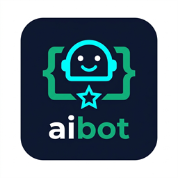

# DevSetu — AI-Powered GitHub Assistant

<p align="center">
  
</p>

<p align="center">
  <b>Autonomous, senior-level issue triage, debugging, and code patches powered by Google Gemini 3.5 Flash.</b>
</p>

---

## 🚀 Overview

**DevSetu** ("Developer Bridge") connects developer issues and discussions directly with Google's state-of-the-art **Gemini 3.5 Flash** model. Tagging `@devsetu` in any issue comment triggers immediate, structured engineering guidance, reproduction steps, and ready-to-merge code fixes.

- **🌐 Live Product Website:** [https://aibot-sonurust.vercel.app](https://aibot-sonurust.vercel.app)
- **⚡ Webhook Endpoint:** `https://aibot-github-app.skbhati199.workers.dev`
- **📦 GitHub App:** [Install on GitHub](https://github.com/apps/devsetu-app)

---

## 🛠️ Key Capabilities

- **Contextual Issue Triage:** Analyzes issue title, description, labels, and conversation history.
- **Actionable Code Patches:** Generates syntax-highlighted code snippets and diffs.
- **Senior-Level Architecture Advice:** Provides guidance on performance, security, and edge cases.
- **Edge Performance:** Powered by serverless Cloudflare Workers with sub-second response times.
- **Zero Retention Privacy:** Your code and discussions are never stored or trained on.

---

## 💡 How to Use

Simply mention `@devsetu` in any issue or pull request comment:

```markdown
@devsetu TypeError: Cannot read properties of undefined (reading 'map') in RepositoryList.tsx
```

DevSetu will review the context and reply with a structured breakdown:
- 📌 **Summary**
- 🔍 **Technical Analysis**
- 💡 **Recommended Solution**
- ⚠️ **Considerations & Edge Cases**
- 🚀 **Next Steps**

---

## ⚙️ Architecture & Deployment

### 1. Cloudflare Workers (`src/index.js`)
Handles GitHub webhook events (`issue_comment.created`), verifies HMAC signatures with `@octokit/app`, and generates replies using the Gemini API.

```bash
# Deploy to Cloudflare
npx wrangler deploy
```

### 2. Standalone GitHub Action (`.github/workflows/devsetu-comment.yml`)
Run DevSetu directly in your repository without hosted infrastructure.

```yaml
on:
  issue_comment:
    types: [created]

jobs:
  reply:
    if: github.event.comment && contains(github.event.comment.body, '@devsetu') && github.event.comment.user.type != 'Bot'
    runs-on: ubuntu-latest
    steps:
      - uses: actions/github-script@v7
        env:
          GEMINI_API_KEY: ${{ secrets.GEMINI_API_KEY }}
        # ...
```

---

## 📄 License & Privacy

- [Privacy Policy](PRIVACY.md)
- Built with ❤️ by [Sonu Kumar](https://github.com/sonurust)
